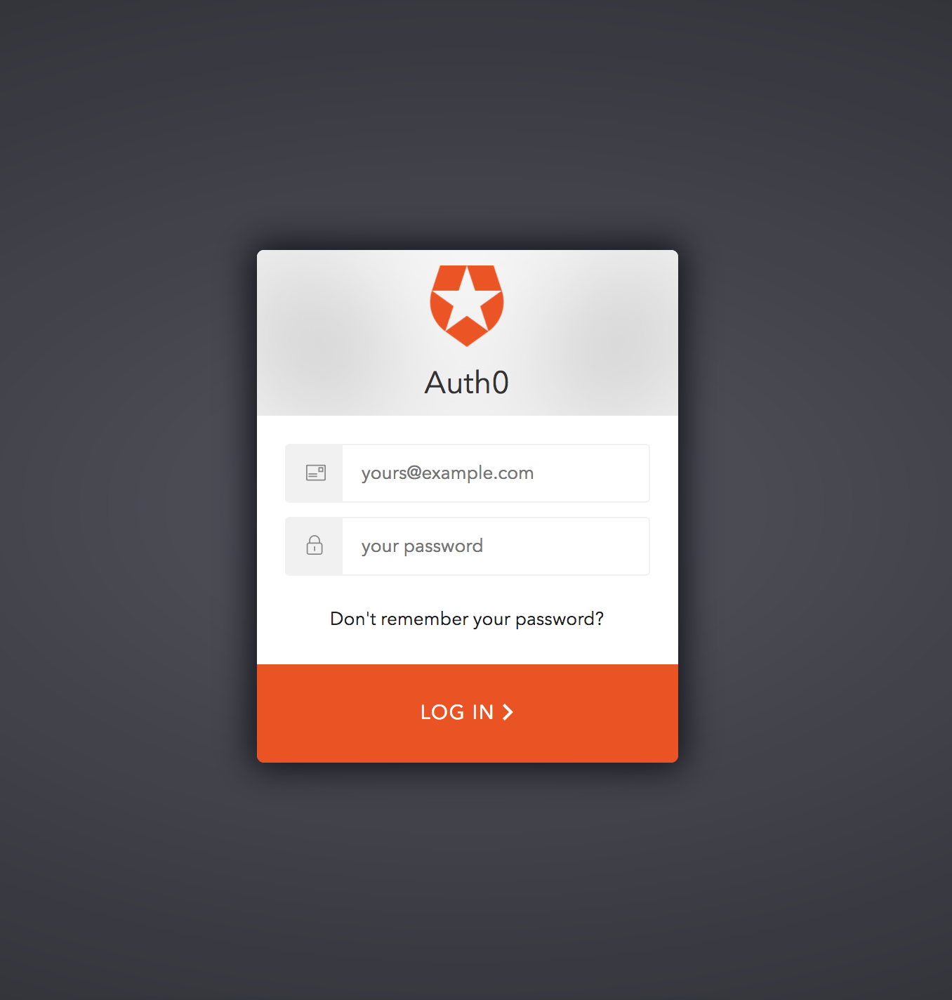
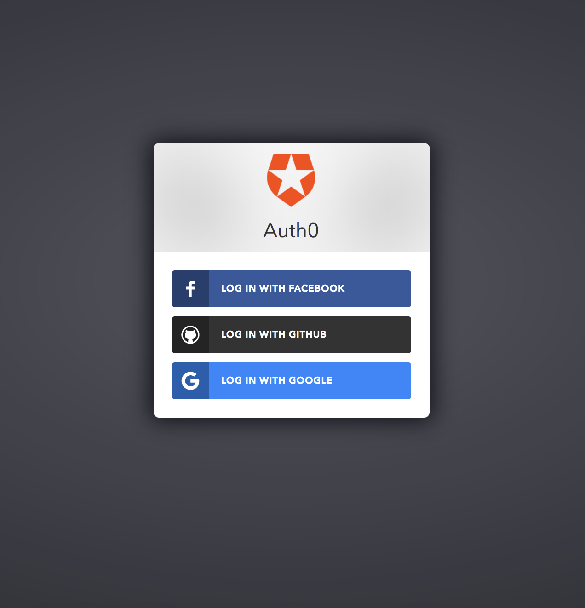
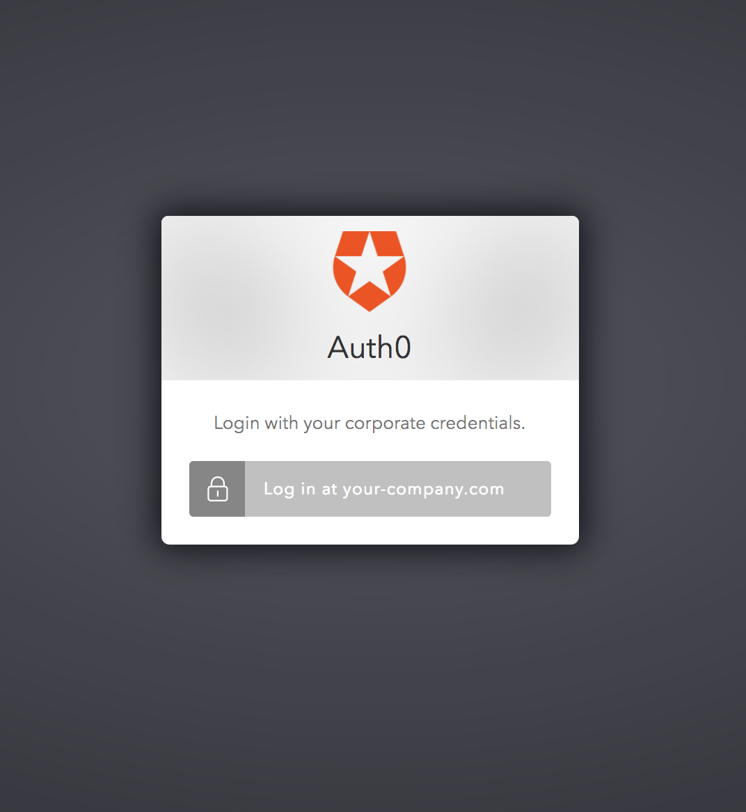
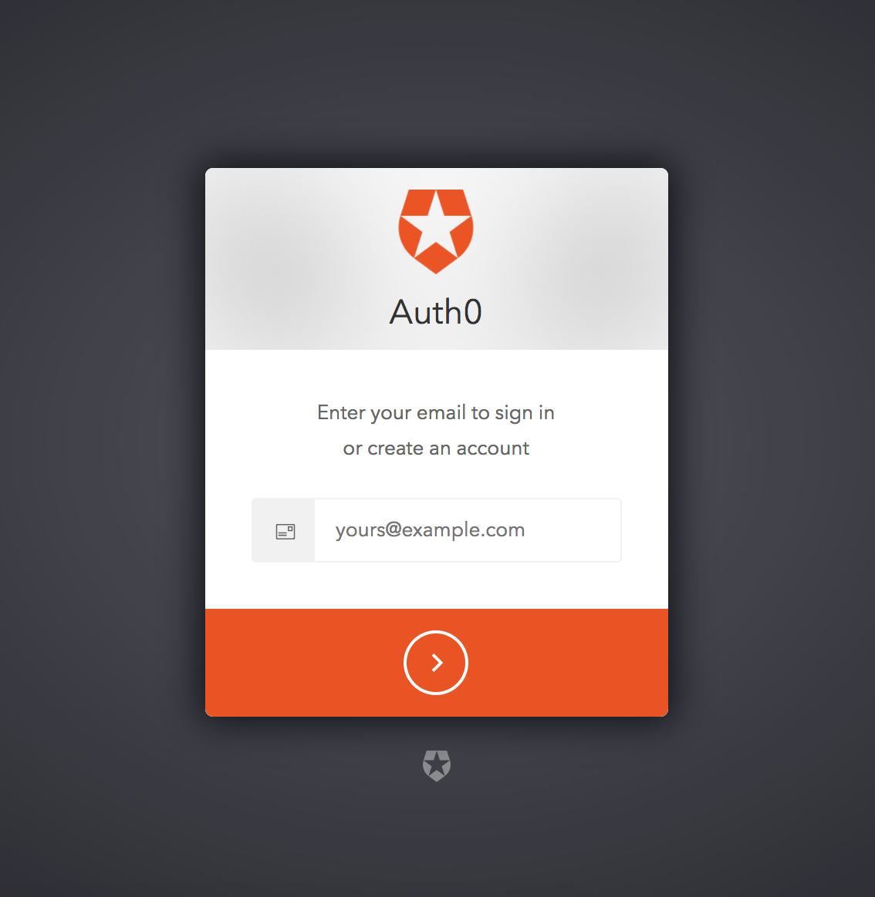
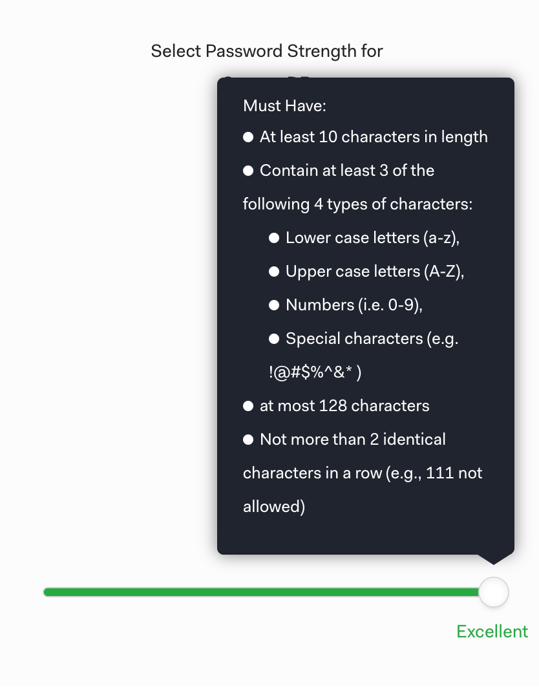
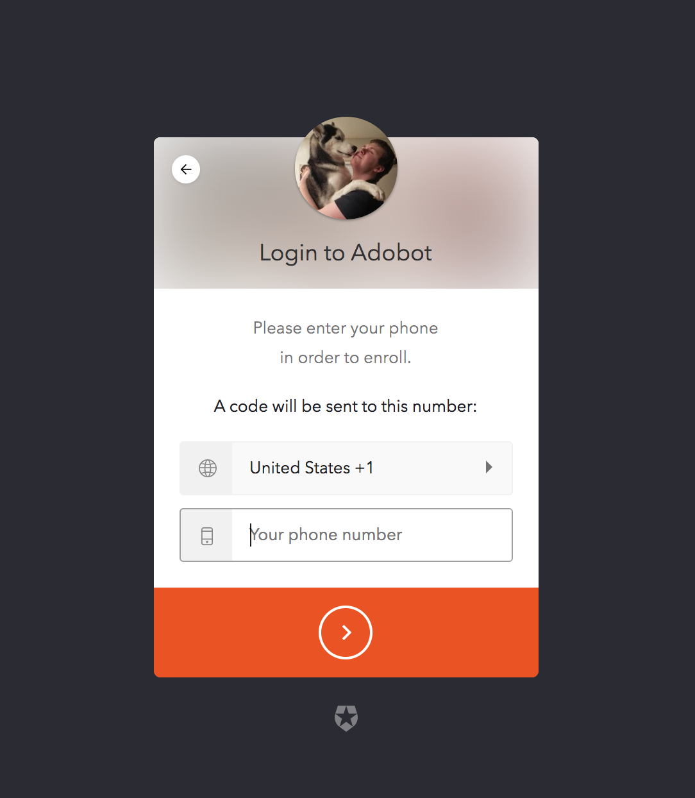

## Intro to Modern Identity
#### Jeremy Meiss

---
## About Me
![ARGH](assets/images/img_jeremy_2014.jpg
#### Jeremy Meiss
Head of Community, Auth0 
<i class="fa fa-twitter"></i> @IAmJerdog 
<i class="fa fa-web"></i>https://auth0.com 

---?image=assets/images/face.jpg&size=auto 90%
## What is Identity?

Note:
Digital identity is at the core of any application - invisible yet crucial. We often take identity for granted as most of its magic happens behind the scenes. But identity plays a much larger role beyond just at the login screen for your applications.

---
## What is **Modern** Identity?

* Authentication
* Authorization
* Personalization
* Security

Note:
Identity management is more than just being able to stick a username and password into a login box. It's very difficult to do right, and login will throw a wrench in the works if it's done wrong. But when you're committed to the best practices for login management, your business can benefit in ways you might not have realized. At a high level, we can break up identity into four distinct components: authentication, authorization, personalization, and security - with all of these points (Authentication, Authorization, Security, Personalization) having existed for a long time.

---
## Authentication
### The way you login

Note:
Authentication will dictate how users login to your application. This used to be as simple as a username and password. Who here remembers not really having any requirements for a username/password? Now it's a lot more complicated, which is a good thing. We still have the uid/pwd option, but have added social connections (FB / Twitter), enterprise federation and SSO, and even "passwordless" to the mix. Implementing all of these into your application can be a time-consuming, and even scary proposition given the stakes that are often at risk.

---
## Authorization
### Right access, right time

Note:
Authorization ensures the right users have the right access at the right time. For instance, admins should be easily able to make system-wide changes, while regular users can only make changes relative to themselves. Access has to be fine-tuned, regardless of how large (or small) the app/business is. This requires that multiple departments, regions, complex hierarchies, groups, and users moving throughout the system need up-to-date access in order to work effectively. Access is therefore very important to making sure that your app operates as intended - and this can be a very real challenge to getting this aspect of identity right.

---
## Personalization
### Tailored user experience

Note:
The user profile is concerned with the data that your application has collected on each individual user. The better you know your users the better experience and personalization you can provide. With disparate networks and various sets of data floating all around the web, it can be difficult to get a clear understanding of your users, but companies that can will have an upper hand.

---
## Security
### Protecting data in motion and at rest

Note:
Finally, the security part of the modern identity story ensures that user data is protected both in motion and at rest. Security can be looked at through various lenses. The first, starts when a user attempts to login. Protecting user accounts at time of login with multifactor authentication, anomaly detection, and breached password detection are just some of the quick wins that will make your application more secure and stand out from the crowd. Ensuring data is protected at rest, passwords properly encrypted, and adherence to industry standards and certifications are other aspects of security that must be enforced.

---
## Authentication

* Traditional Username and Password
* Social Login via Facebook, Twitter, Google, etc.
* Enterprise Federation and Single Sign On
* Passwordless
* MFA
* Biometrics

Note:

---
### Traditional Username & Password

@div[left-50]

@divend

@div[right-50]
 
@ul[brighten]
* Most Common
* Easy to Implement
* Least Secure
@ulend
@divend

Note:
"Easy to implement" here is a fallacy as actually it's not, as it's not easy to reach the level of security that you should be aiming for.

---
### Social Login

@div[left-50]

@divend

@div[right-50]
 
@ul[brighten]
* Common
* Medium Difficulty
* More secure
@ulend
@divend

Note:

---
### Single Sign On

@div[left-50]

@divend

@div[right-50]
 
@ul[brighten]
* Most Common in Enterprise
* Solves authorization use cases
@ulend
@divend

Note:
SSO is important but not modern in the true sense of the concept as it's been around awhile and isn't terribly difficult to implement, likely the easiest for developers.

---
### Passwordless

@div[left-50]

@divend

@div[right-50]
 
@ul[brighten]
* Rare / Up and Coming
* Easy to Implement
* More Secure than with password
@ulend
@divend

Note:
Passwordless is more secure than using a password. No passwords are stored.

---?image=assets/images/b-j-1067305-unsplash.jpg&size=auto 90%&opacity=60
## Authorization

* Ensure the user has the right access at the right time
* Change and revoke access

Note:

---?image=assets/images/jon-moore-399469-unsplash.jpg&size=auto 90%
## Security
 
#### Identity doesn't end at the login screen

Note:
Unfortunately, we can't even go a few months without hearing about breaches of user login information and identities. As more companies implement an online or app presence and more consumers sign up for those accounts, the stakes of a security compromise only grow with each passing year. There are multiple different ways to ensure that users and their identities are being taken care of.

---
### Passwords

@div[left-50]
 
@ul[brighten]
* Complexity
* Storage and Security
@ulend
@divend

@div[right-50]

@divend

Note:

---
### Multifactor Authentication

@div[left-50]
 
@ul[brighten]
* Something you know
* Something you have
* Something you are
@ulend
@divend

@div[right-50]

@divend

Note:

---
### Brute Force Protection

@div[left-50]
 
@ul[brighten]
* Prevent repeated failed login attempts
* Alert user and validate identity
@ulend
@divend

@div[right-50]

@divend

Note:

---
### Anomaly Detection

@div[left-50]
 
@ul[brighten]
* Proactively protect users
* Alert user of suspicious activity
* **Breached Password Detection**
@ulend
@divend

@div[right-50]

@divend

Note:

---?image=assets/images/chuttersnap-758245-unsplash.jpg&size=auto 90%&opacity=60
## Personalization

* Give a personal touch to each user
* Make Data Work for You
* Enhanced Analytics

Note:

---
## Why Modern Identity?

@ul
1. Higher Conversion Rates
2. Better User Experience
3. Increased Revenue
4. Enhanced Security
@ulend

Note:
3 Big Reasons

---
#### Data and Security Breaches

### Not **IF**, but **WHEN**

Note:

---?image=assets/images/data-breaches.png&size=auto 80%

---
## With Modern Identity you can Better Protect Yourself

Note:

---
## Implementing Modern Identity

### Build vs Buy

Note:

---
## Build Modern Identity In-House

Pros|Cons
---|---
Full Control | Complex and difficult
Feature Parity | Cost to build and maintain
No external dependency | Not Core Competency

Note:

---
## Buy 3rd Party Solution

Pros|Cons
---|---
Time to Market | Reliance on 3rd Party
Dedicated Experts | Features may not fit needs
Little Maintenance | Cost

Note:
Unless you decide to sink your resources into building a full-scale identity management team, you simply won't be able to tap into the benefits that a robust IAM solution can offer you. Besides that, outsourcing identity management can help you increase productivity, collaboration, efficiency and security in your organization through consolidated identity.

---
## Auth0

### Identity as a Service

@div[left-50]

@divend

@div[right-50]
 
@ul[brighten]
* Modern Identity in **10 Minutes**
* Free Tier (7,000 Monthly Active Users)
* Team of Security Experts
@ulend
@divend

Note:

---
## Thank You!

### Questions?

Note:
The question is no longer “should we or shouldn’t we”, but rather “how do we modernize our platform” for current and future needs. The software industry is going through a radical transformation and legacy monolithic applications are no longer compatible with today’s business needs and user expectations. Application modernization is not something that can be achieved overnight and there are many paths to the end goal, but starting with identity is a surefire win-win for both your organization and your users.
